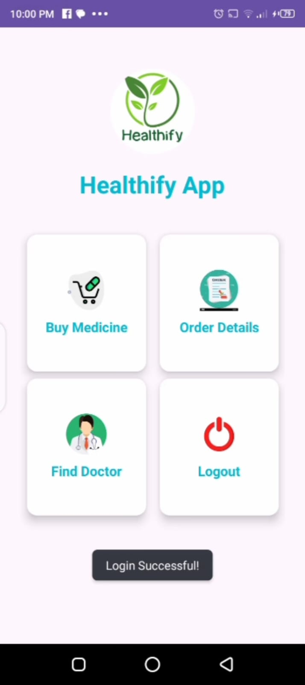
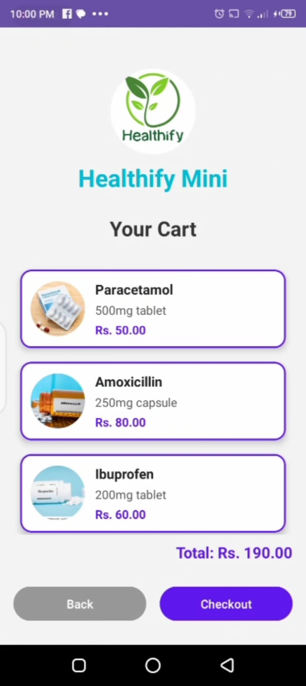

# HealthifyCare App 🏥

HealthifyCare is an Android healthcare application designed to make healthcare services easier and more accessible.

## 🚀 Features
- Book doctor appointments
- Buy medicines online
- Add items to cart
- View appointment details
- Simple and user-friendly UI

## 🛠️ Built With
- Kotlin
- Android Studio
- XML Layouts

## 📱 Screenshots

### 🏠 Home Screen

### 🦠 Disease Information Screen

### 💊 Medicine Store Screen

### 🛒 Cart Screen

### 🔍 Search Doctor Screen

### 📅 Book Appointment Screen

### 💳 Checkout Screen

## 👩‍💻 Developer
- vibxanu

## 📌 Project Purpose
This project is built for learning Android development and creating a real-world healthcare application experience.
